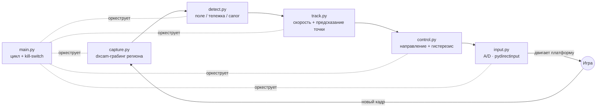
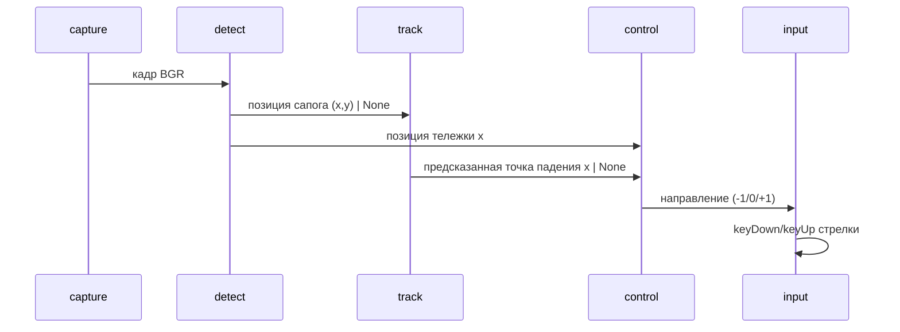

# ARCHITECTURE — архитектура бота d2

## High-level

## Слои и модули

| Модуль | Ответственность | Зависимости | Тестируемость |
|---|---|---|---|
| `config` | Пороги, геометрия, клавиши | — | — |
| `capture` | Захват кадра BGR | dxcam, cv2 | live |
| `detect` | Координаты поля/тележки/сапога | cv2, numpy | реальные кадры (`assets/frames/`) |
| `track` | Скорость сапога, предсказание точки падения | — (чистый Python) | **юнит-тесты** |
| `control` | Решение «влево/стоять/вправо» | — (чистый Python) | **юнит-тесты** |
| `input` | Эмуляция ввода в игру (A/D + пробел) | pydirectinput | live |
| `main` | Конечный автомат (SETUP/PLAYING), стартовая секвенция, kill-switch, latency | все выше | live |

**Принцип разделения:** `track`/`control` — чистая логика без OpenCV/ввода, поэтому
проверяются юнит-тестами без запущенной игры (§3 CLAUDE.md). Тяжёлые/побочные модули
(`capture`/`detect`/`input`/`main`) изолированы и валидируются на реальных кадрах / вживую.

## Поток данных (один тик цикла)

## Ключевые решения

- **Предсказание по наклону, а не по времени.** Точка падения = функция vx/vy; время
  сокращается → скорость берём в пикселях/кадр, без часов. Упрощает и делает детерминированным.
- **Отскоки «треугольной волной».** `reflect_1d` разворачивает многократные отражения от
  стенок в одну формулу вместо пошаговой симуляции.
- **ROI-соотношения вместо жёстких пикселей.** Геометрия поля хранится долями кадра —
  устойчивость к разрешению захвата.
- **Kill-switch обязателен.** Эмуляция ввода перехватывает клавиатуру → мгновенный стоп по
  F12/Ctrl+C с гарантированным отпусканием клавиш (§10 CLAUDE.md).
