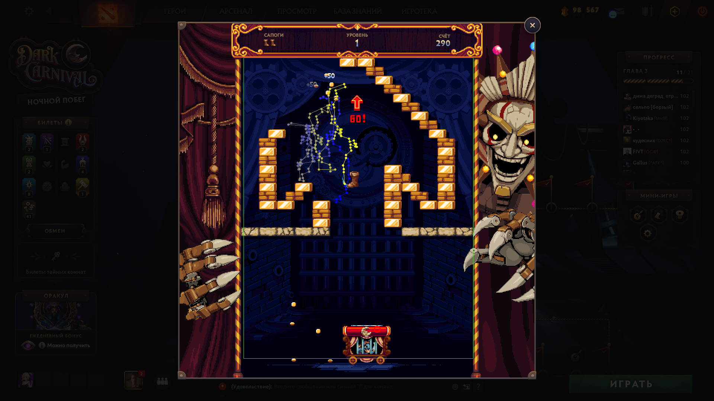

<div align="center">

# 🥾 Boot Breaker Bot — автопрохождение мини-игры «Сапожный снос» (Dota 2 · Dark Carnival)

### Бот, который сам проходит мини-игру **«Сапожный снос»** из ивента **Dota 2 Dark Carnival / Crownfall** — видит экран, ловит сапог и фармит очки, уровни и билеты за вас.

[](https://www.python.org/)
[](#требования)
[](#как-это-работает)
[](#технологии)
[](#лицензия)

</div>

---

> **TL;DR:** Устали вручную часами отбивать сапог, чтобы набить 10 000 / 20 000 очков и получить билеты Dark Carnival? Этот бот на компьютерном зрении делает это сам: запускает мяч, ведёт тележку под сапог и **проходит уровень за уровнем без вашего участия**.

## 📖 Что такое «Сапожный снос» (Boot Breaker)

**«Сапожный снос»** (англ. **Boot Breaker**) — аркадная мини-игра в стиле **Arkanoid / Breakout** из события **Dark Carnival** (глава Crownfall) в **Dota 2**. Вместо мячика — сапог Tresdin, вместо ракетки — тележка Slark: нужно отбивать сапог, разбивать блоки и набирать очки. За **1 000** очков — переход на следующий уровень, за **10 000** и **20 000** — карнавальные билеты (награды ивента).

Проблема одна: это **долго и однообразно**. Бот убирает рутину — вы получаете прогресс и награды, не втыкая в отскоки сапога вручную.

## ✨ Возможности

- 🎯 **Полный автопилот** — сам запускает сапог, ловит его и **переходит между уровнями** (уровень пройден → следующий стартует автоматически).
- 👁️ **Компьютерное зрение в реальном времени** — «видит» игру через быстрый захват экрана (dxcam) + OpenCV, без чтения памяти игры и без инъекций в процесс.
- ⚡ **Молниеносная реакция** — в тестовом прогоне цикл «увидел → решил → нажал» ~**2.8 мс (≈350 FPS)**; тележка успевает за сапогом.
- 🧠 **Умная детекция** — отличает летящий сапог от декораций и **бирюзовых блоков 2-го уровня**, не залипает на фоне.
- 🛑 **Аварийный стоп** — мгновенная остановка по **F12 / Ctrl+C**, клавиши всегда отпускаются.
- 🔧 **Прозрачные настройки** — все пороги в одном `config.py`; калибровка направления и логирование сессии «из коробки».

## 📸 Как бот видит игру

<div align="center">



*Путь сапога, распознанный ботом за один розыгрыш (синий → жёлтый = ход времени). Зелёная рамка — игровое поле, красный — тележка.*

</div>

**Результаты эталонного прогона** (`samples/perfect-run.csv`, реальная игра):

| Показатель | Значение |
|---|---|
| Средняя задержка цикла | **2.8 мс (~353 FPS)** |
| Время в активной игре | **88%** |
| Пройдено переходов между уровнями | ~40 за сессию |
| Ложные срабатывания детекции | 0.26% |

## 🚀 Быстрый старт

Полная пошаговая инструкция — в **[QUICKSTART.md](QUICKSTART.md)**. Совсем коротко:

```bash
# 1. Поставить зависимости
python -m pip install -r requirements.txt

# 2. Открыть в Dota 2 мини-игру «Сапожный снос» (окно без рамки 1920×1080)

# 3. Запустить бота (за 2 секунды сделай окно игры активным)
python -m src.main
```

Управление в игре — **A/D** + пробел; бот эмулирует их сам. Стоп — **F12** или **Ctrl+C**.

## 🎮 Как это работает

```
захват экрана (dxcam) → детекция сапога и тележки (OpenCV)
        → трекинг и выбор цели → движение тележки (A/D) → повтор ~350 раз/сек
```

Единая модель состояний ведёт бота через весь ивент: **летит** сапог → ловим (тележка следует за сапогом); **висит/нет сапога** (пред-пуск, экран между уровнями) → жмём пробел. Подробно — в [LOGIC.md](LOGIC.md) и [ARCHITECTURE.md](ARCHITECTURE.md).

## 🧩 Требования

- **Windows** (захват через DXGI/dxcam).
- **Dota 2**, ивент **Dark Carnival**, мини-игра «Сапожный снос» в режиме **окна без рамки 1920×1080**.
- **Python 3.12+**.
- Зависимости: `dxcam`, `opencv-python`, `numpy`, `pydirectinput`, `keyboard` (см. `requirements.txt`).

## ❓ FAQ

**Как пройти «Сапожный снос» вручную?** Двигайте тележку (A/D) под падающий сапог и отбивайте его вверх, разбивая блоки; набирайте 1 000 очков за уровень. Этот бот делает то же самое автоматически.

**Что делает бот на 2-м уровне и дальше?** Автоматически проходит переход и запускает новый мяч. Детекция различает сапог и цветные блоки уровней.

**Нужен ли доступ к памяти Dota 2 / инъекции?** Нет. Бот работает только по картинке с экрана и эмуляции клавиш — как если бы играл человек.

**Какое разрешение поддерживается?** Откалибровано под **1920×1080** (окно без рамки). Геометрия масштабируется под размер кадра; иные разрешения могут потребовать подстройки в `config.py`.

**Тележка едет не туда / ничего не ловит?** Проверьте направление и скорость: `python -m src.main --calibrate`. Диагностика сессии — `--log run.csv`. См. [QUICKSTART.md](QUICKSTART.md).

## 🛠 Технологии

Python · OpenCV · NumPy · dxcam (DXGI screen capture) · pydirectinput (SendInput) · pytest.

## 🗺 Roadmap

Дальнейшие планы: устойчивость на старших уровнях (новые цвета блоков), прицельное выбивание блоков под нужным углом, поддержка иных разрешений.

## 📄 Лицензия

Проект распространяется по лицензии **MIT** — см. [LICENSE](LICENSE). Не аффилирован с Valve Corporation; Dota 2, Dark Carnival, Crownfall — товарные знаки Valve.

---

<div align="center">
<sub>Ключевые слова: Dota 2 Сапожный снос бот · Boot Breaker bot · Dark Carnival мини-игра · Crownfall автопрохождение · как пройти Сапожный снос · farm carnival tickets · Arkanoid Breakout Dota 2.</sub>
</div>
